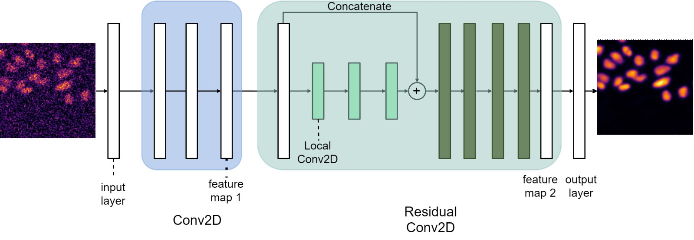
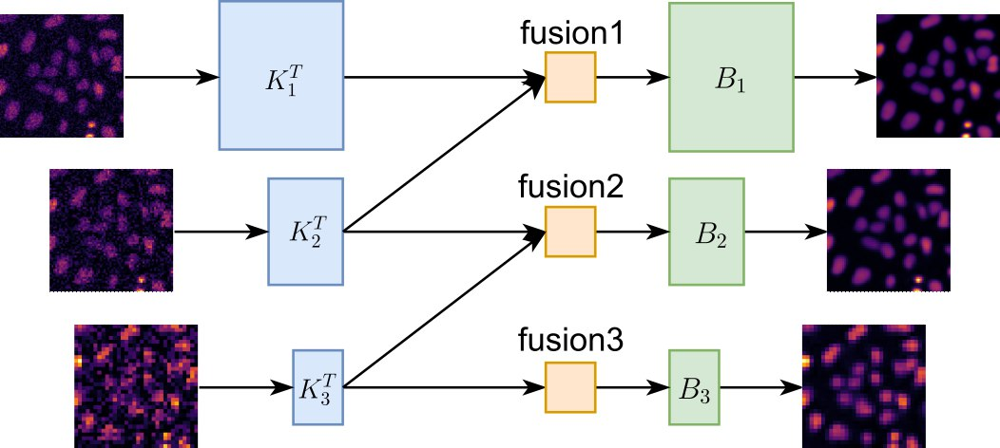
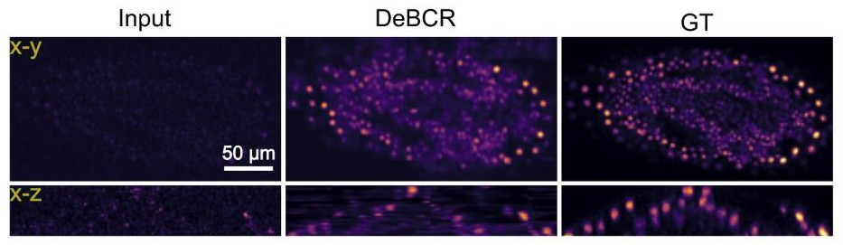

# DeBCR
### Denoising, deblurring, and optical deconvolution using a physics-informed neural network for light microscopy

**DeBCR** is a physics-informed deep learning model for light microscopy image restorations (deblurring, denoising, and deconvolution).

**DeBCR** is an open-source project and is licensed under [MIT license](LICENSE).

 For the installation/usage questions please write to the [Issue Tracker](https://github.com/leeroyhannover/DeBCR/issues).

## Contents

- [Quick start](#quick-start) - resources to get started with **DeBCR**
- [About DeBCR](#about-debcr) - key points of the network structure and results examples
- [Local usage](#local-usage) - instructions on local install, training and prediction
- [Example datasets](#example-datasets) - publicly deposited example datasets used for DeBCR benchmarks/tutorials

## Quick start

We prepared multiple resources to help you get started with DeBCR (in order of complexity and flexibility):
1. `CodeOcean capsule` (*link will become available soon*) - a ready-to-run environment with the provided data and trained model to get a first impression of the DeBCR results for various image restoration tasks.
2. `Google Colab Notebook(s)` - the interactive notebook(s) with accessible GPU resources available online, see the table below (to be extended).
   | Notebooks                                                                                               | Description |
   | :------------------------------------------------------------------------------------------------------ | ----------- |
   | [DeBCR_train](https://githubtocolab.com/leeroyhannover/DeBCR/blob/main/notebooks/DeBCR_train.ipynb)  | Demostrates DeBCR training data and parameters setup and training process. The example data is available. |

3. `Open-source code` (this GitHub repository) with guidelines on its [Local usage](#local-usage) for training and prediction.

## About DeBCR

**DeBCR** is implemented based on the original Beylkin-Coifman-Rokhlin (BCR) model, implemented within DNN structure:


In contrast to the traditional single-stage residual BCR learning process, DeBCR integrates feature maps from multiple resolution levels:


The example of the **DeBCR** performance on the low/high exposure confocal data (*Tribolium castaneum* from [CARE](https://www.nature.com/articles/s41592-018-0216-7)) is shown below:


For more details on implementaion and benchmarks please see our preprint:

Li R., Yushkevich A., Chu X., Kudryashev M., Yakimovich A. Denoising, Deblurring, and optical Deconvolution for cryo-ET and light microscopy with a physics-informed deep neural network DeBCR. *in submission*, 2024.

## Local usage

To use `DeBCR` locally you need to have:
- a GPU-empowered machine with at least 16GB VRAM;
- `CUDA`, currently `CUDA-11.5` or `CUDA-11.7` (we are working on DeBCR environments for other CUDA versions);
- `git` to be able to clone this repository;
- python package manager for environment, e.g. `(micro)mamba` ([mamba.readthedocs.io](https://mamba.readthedocs.io/)) or `conda-forge` ([conda-forge.org](https://conda-forge.org/)).

Otherwise it is also possible to train **DeBCR** via provided Google Colab Notebook (for a link see [Quick start](#quick-start))

### Local installation
Installation steps are:
1. **Download the source code.**
    * clone repository to desired location via
    ```bash
    git clone https://github.com/leeroyhannover/DeBCR.git
    ```
    * go to the `DeBCR` folder (needed for further steps)
    ```bash
    cd /path/to/DeBCR
    ```
2. **Prepare environment with CUDA.**
    * create and activate package environment
    ```bash
    micromamba env create -n debcr-env -c conda-forge python=3.9 pip
    micromamba activate debcr-env
    ```
    * install CUDA dependencies - please use the following setup for CUDA-11.5/7
    ```bash
    micromamba install cudatoolkit=11.7 cudnn=8.4
    pip install -r requirements_cuda11.txt
    ```
3. **Install `DeBCR` dependencies.**
    ```bash
    pip install -r requirements.txt
    ```

For GPU devices recognition (CUDA-11.5/7 setup above) during local DeBCR usage, please make the following export:
```bash
export LD_LIBRARY_PATH=/path/to/micromamba/envs/debcr-env/lib/python3.9/site-packages/nvidia/cudnn/lib/:${LD_LIBRARY_PATH}
```
with the actual location and name of your `DeBCR` environment. 

We also recommend to check that TensorFlow library, needed for our model, recognizes GPUs:
```bash
python
>>> import tenforflow as tf
>>> tf.config.list_physical_devices('GPU')
```
for a single GPU you should see something like:
```
[PhysicalDevice(name='/physical_device:GPU:0', device_type='GPU')]
```

Howeevr, if the output list is empty, please check that you have:
* available and visible GPU
* installed and sourced **CUDA Driver** and **CUDA Tollkit** for `CUDA-11.5/7`
* installed CUDA dependencies for python (see instructions above)
* activated correct python package environemnt for `DeBCR` 
* exported to `LD_LIBRARY_PATH` correct path to cudnn libraries from your `DeBCR` environment (see instructions above)

### Local training

For the local training we provide an example Jupyter Notebook [train_local.ipynb](train_local.ipynb), which is located in the parent directory of the repository. This notebook guides you through the training process using provided examples of already pre-processed data, which are publicly available on Zenodo (for a link see [Example datasets](#example-datasets)). Currently the notebook covers the following example task/dataset:
- **LM: 2D denoising** (files: LM_2D_CARE_X.npz) - low/high exposure confocal dataset of *Schmidtea mediterranea* (`Denoising_Planaria` dataset) from the publication of CARE network applied to fluorescent microscopy data ([Weigert, Schmidt, Boothe et al., Nature Methods, 2018](https://www.nature.com/articles/s41592-018-0216-7)).

The same data is used to train **DeBCR** in additionally provided Colab Notebook (for a link see [Quick start](#quick-start)). The preprocessing procedures from raw LM microscopy data will become available in the future.

To get started with the notebook, you need to additionally install [Jupyter Notebook or Jupyter Lab](https://jupyter.org/install) in your `DeBCR` environment, open it and, if needed, switch kearnel to your DeBCR environment `debcr-env`.
Further please follow the instructions in the [train_local.ipynb](train_local.ipynb) notebook for the training.

### Local prediction

For the local prediction (test), you need to activate previously installed `debcr-env` environment in the command line:
```bash
conda activate debcr-env
```

The prediction can be runned on the pre-processed (patched and normalized) data input in NumPy array (.npz) format. The provided data (see [Example datasets](#example-datasets)) is availale to test `DeBCR` on all 4 tasks: 2D and 3D denoising, super-resolution deconvolution from widefield and confocal data.

The data should be currently organized as the following example for LM_2D_CARE dataset used in our tutorials and benchmarks:
```
data
└── 2D_denoising
    ├── test
    │   └── LM_2D_CARE_test.npz
    ├── train
    │   └── LM_2D_CARE_train.npz
    └── val
        └── LM_2D_CARE_val.npz
```

The up-to-date usage instructions can be obtained by
```bash
python /path/to/DeBCR/tester_DeBCR.py --help
```

and are provided as well below:
```bash
usage: tester_DeBCR.py [-h] [--task_type {2D_denoising,3D_denoising,bright_SR,confocal_SR}] [--weights_path WEIGHTS_PATH] [--ckpt_name CKPT_NAME] [--testset_path TESTSET_PATH]
                       [--save_fig] [--fig_path FIG_PATH] [--results_path RESULTS_PATH] [--whole_predict] [--gpu_id GPU_ID]

DeBCR: DL-based denoising, deconvolution and deblurring for light microscopy data.

optional arguments:
  -h, --help            show this help message and exit
  --task_type {2D_denoising,3D_denoising,bright_SR,confocal_SR}
                        Task type to perform according to data nature. (default: 2D_denoising)
  --weights_path WEIGHTS_PATH
                        Path to the folder containing weights (checkpoints) of the trained DeBCR model. (default: ./weights/TASK_TYPE/)
  --ckpt_name CKPT_NAME
                        Filename (w/o file extension) of the checkpoint of choice (can be a wildcard as well).
                        If not provided, the latest (by sorted filename) checkpoint file will be used. (default: ckpt-*)
  --testset_path TESTSET_PATH
                        Path to the test datset as a single NPZ file. (default: None)
  --save_fig            Flag to enable saving figures of the example test results. (default: False)
  --fig_path FIG_PATH   Path to save figures of the example test results. (default: ./figures/)
  --results_path RESULTS_PATH
                        Path to save the test results. (default: ./results/)
  --whole_predict       Flag to enable predicting the whole image for certain tasks. (default: False)
  --gpu_id GPU_ID       GPU ID to be used. (default: 0)
```

## Example datasets

To evaluate **DeBCR** on various image restoration tasks, several previously published datasets were assembled, pre-processed and publicly deposited as NumPy (.npz) arrays in three essential sets (train, validation and test). The datasets aim at multiple image restoration tasks such as denoising and super-resolution deconvolution.

Access data and its details on Zenodo: [10.5281/zenodo.12626121](https://zenodo.org/doi/10.5281/zenodo.12626121).
